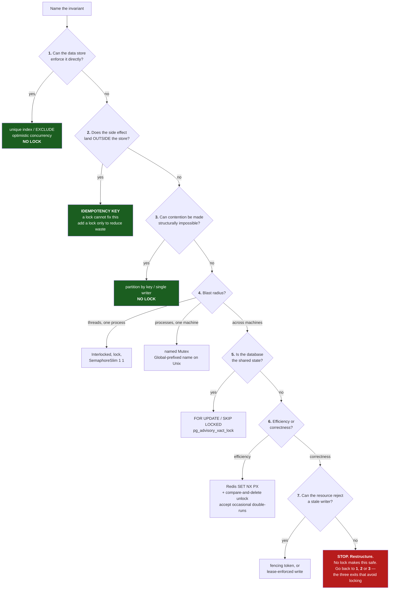

# Locking: a decision framework

For developers deciding whether they need a lock, and which one.

**How to use this.** Part 1 is the map — what exists and what each thing
actually guarantees. Part 2 is the eight questions you should be able to
answer before writing any lock. Part 3 is the decision tree. Part 4 is the
set of approaches that avoid locking entirely, which is where a surprising
number of these questions land.

The single most useful idea here:

> **A lock is never the goal. Protecting an invariant is.**
> Locking is one of several ways to do that, and it is the one that degrades
> worst as scope widens — from a language guarantee, to an OS guarantee, to a
> database guarantee, to a hopeful assumption about clocks.

---

## Part 1 — The map

What exists, and what it actually promises. **"Fences?" means: does the
protected resource itself reject a stale writer?** That column is the one
that separates "safe" from "safe as long as nothing pauses."

### In-process

| Mechanism | Async | Reentrant | The gotcha |
|---|---|---|---|
| `Interlocked` | n/a | n/a | Only helps when the invariant is a single word |
| `lock` / `Monitor` | **no** | yes | Cannot `await` inside — ownership is thread-bound |
| `System.Threading.Lock` (.NET 9+) | no | yes | Held in an `object`-typed variable it silently falls back to `Monitor`, **and the two do not mutually exclude each other** |
| `SemaphoreSlim(1,1)` | **yes** | **no** | `new SemaphoreSlim(1)` sets maxCount to `int.MaxValue` — a stray `Release()` silently raises your concurrency limit |
| `ReaderWriterLockSlim` | no | opt-in | Frequently slower than a plain `lock`; measure before assuming |
| `Lazy<T>` | n/a | n/a | The lock you didn't have to write |

### One machine

| Mechanism | Scope | The gotcha |
|---|---|---|
| named `Mutex` (Unix) | **POSIX session**, not the machine | Unprefixed names are scoped to `getsid`. Use a `Global`-prefixed name or your single-instance guard silently fails across systemd units and SSH sessions |
| named `Mutex` (Windows) | **Terminal Services session** | Unprefixed means `Local\`. A service runs in session 0 and a desktop app in session 1+, so they don't contend. `Global\` generally needs `SeCreateGlobalPrivilege` |
| named `Mutex` (WSL ↔ Windows) | **nothing is shared** | Different implementations entirely. `Global\` does not help. "Works on my machine" in WSL says nothing about deployed Windows behaviour |

### Database

| Mechanism | Releases on crash | Fences? | The gotcha |
|---|---|---|---|
| `SELECT … FOR UPDATE` | yes — tx rollback | implicitly yes | The row must already exist |
| `FOR UPDATE SKIP LOCKED` | yes | yes | It's a work queue, not a mutex — that's the point |
| `pg_advisory_xact_lock` | yes — commit/rollback | no | `hashtext()` returns `integer`, so the common idiom has ~2³² keys, not 2⁶⁴ |
| `pg_advisory_lock` | on disconnect only | no | Correct on a **dedicated** connection (leader election); **leaks through any pool**. Under EF Core the connection closes right after the statement, so one `ExecuteSqlRaw` is enough |
| Optimistic concurrency | n/a | **yes** | Retry storms under high contention |
| Unique index / `ON CONFLICT` | n/a | **yes** | Free, and usually the right answer to "only once" |

### Across machines

| Mechanism | Releases on crash | Fences? | The gotcha |
|---|---|---|---|
| Redis `SET NX PX` | TTL | no | Unlock must be compare-and-delete; expires mid-work |
| Redlock | TTL | no | Contested; see §4 of the talk. Complexity for a safety property it doesn't fully deliver |
| etcd / ZooKeeper lease | session expiry — 20 s default | **yes** (revision/zxid) | Real answer, real ops cost. Best loss detection of any provider |
| MongoDB (via `DistributedLock`) | TTL — 30 s | **yes** — exposes `FencingToken` | The only TTL provider that can be made genuinely safe |
| Azure Blob lease | 15–60 s or infinite | **that blob only** | `DistributedLock.Azure` leases a *sentinel* blob by default — mutual exclusion without the fencing. `Duration(-1)` means a dead holder never releases |
| Idempotency key | n/a | **yes** | Needs a dedupe store — and is stronger than any lock |

---

## Part 2 — The eight questions

### Four you must answer, or stop

**1. What invariant am I protecting?**
"Only charge the card once" is an invariant. "Two threads shouldn't run this
method" is a symptom. If you can't state it as a property of the data or the
world, you don't yet have a problem statement — and you will pick the wrong
tool.

**2. What does a double-run actually cost?**
This is the fork everything else hangs off.

- **Efficiency** — you pay twice, waste CPU, send a duplicate log line. A
  sloppy lock is fine.
- **Correctness** — data is corrupted, a customer is charged twice, a
  document is overwritten. **A lock alone is never sufficient here.**

> ### Three ways a lock goes stale
>
> "Stale" means *someone else legitimately holds this lock while I still
> think I do*. There are three distinct mechanisms, and they are not equally
> likely. Per-provider assignment: [Part 5](#part-5--dont-write-it-yourself).
>
> **By wall clock** — Redis, Azure leases, MongoDB. A deadline lapses while
> you are paused. **Normal slow work is sufficient**; nothing has to go wrong
> and nothing tells you. Unfixable by configuration — only a fencing token
> helps. This is the common case and it is what `07-expiry.cs` demonstrates.
>
> **By missed heartbeat** — ZooKeeper. A quorum stops hearing from you and
> revokes your session. Same outcome, but no clocks are compared, so clock
> skew and NTP steps are out of the threat model.
>
> **By session death** — SQL Server, Postgres, MySQL, Oracle. No clock exists
> at any layer. The lock only goes stale if something *actively kills your
> session*: a server-side `KILL`, an idle-session timeout, a failover, or
> a **connection pool** handing your connection on. Narrower than "your work
> took longer than 30 seconds", and it usually announces itself as an error on
> your next query.
>
> **The practical difference is how much has to go wrong.** A TTL lock expires
> because you were slow. A session lock expires because something killed your
> connection. That gap is the real argument for step 5 of the tree sitting
> before step 6 — reach for the database you already have before the Redis
> you'd have to add.

**3. Where does the side effect land — inside or outside the store?**
If the protected action reaches outside your transactional store — a payment
API, an email, a partner call, a file — then no lock can prevent duplicates,
because the lock and the side effect can't commit atomically. You need
idempotency.

**4. What's the blast radius?**
Threads in one process? Processes on one machine? Processes across a fleet?
This picks the mechanism family, and it's the question people *think* is
first. It's fourth.

### Four that pick the mechanism

**5. How long is the critical section?**
Milliseconds inside a transaction → a database lock. Minutes → you need a
lease with renewal, and you should ask whether the work can be broken up
instead.

**6. What's the contention?**
Low → optimistic concurrency wins; retries are rare and there's no waiting.
High → locking or queueing wins; optimistic retry turns into a livelock.

**7. Can the protected resource reject a stale writer?**
If yes, you can fence, and you can be genuinely safe. If no, you are relying
on nothing pausing at the wrong moment. Most real resources — an email, an
API call, a physical action — cannot be fenced. Say so out loud.

**8. How will you know when it breaks?**
Locks fail silently. Both the EF Core advisory-lock violation and
the expired-TTL double-run produce **no error and no log line**. If you can't
answer this, add a counter or an assertion before you add the lock.

---

## Part 3 — The decision tree



**Steps 1, 2 and 3 are the exits.** They are the only branches that leave the
diagram without a lock, and they are deliberately first — see
[Why the order is what it is](#why-the-order-is-what-it-is). If step 7 sends
you back, it is sending you to one of these three:

| | Question | If yes |
|---|---|---|
| **1** | Can the data store enforce the invariant itself? | unique index, `EXCLUDE`, optimistic concurrency |
| **2** | Does the side effect land outside the store? | idempotency key |
| **3** | Can contention be made structurally impossible? | partition by key, actor/grain, single writer — [see below](#step-3-in-practice--making-contention-impossible) |

### The same tree, as text

```
0.  Name the invariant.
    Can't name it? You don't have a problem statement. Stop here.

1.  Can the data store enforce it directly?
      uniqueness ................ unique index / INSERT ON CONFLICT
      don't-clobber ............. optimistic concurrency (version column)
      append-only ............... just append
    YES -> no lock. Done.

2.  Does the protected side effect land outside the store?
    (payment, email, partner API, file, published message)
    YES -> you need IDEMPOTENCY, not mutual exclusion.
           A lock reduces duplicates; it cannot prevent them.
           You may still add a lock, but only as an efficiency measure.

3.  Can contention be made structurally impossible?
      partition by key (Kafka / Service Bus sessions)
      actor or grain per entity (Orleans)
      consistent hashing across workers
      one designated writer
    YES -> no lock. Done.
    Needs you to CONTROL THE ROUTING, so this usually works for queue-driven
    work and usually fails for "any pod can serve this HTTP request".

4.  Blast radius?
      threads, one process ...... Interlocked > lock/Lock > SemaphoreSlim(1,1)
                                  (pick the first one that fits; async forces
                                   SemaphoreSlim)
      processes, one machine .... named Mutex, Global-prefixed on Unix
      across machines ........... continue

5.  Is the database the shared state, and does the work fit in a transaction?
      row already exists ........ SELECT ... FOR UPDATE
      pulling from a queue ...... FOR UPDATE SKIP LOCKED
      no row yet / abstract key . pg_advisory_xact_lock
      never .................... pg_advisory_lock  (leaks through pools)
    YES -> done. This is the best distributed lock most teams have.

6.  Efficiency or correctness?
    EFFICIENCY -> Redis SET NX PX + unique token + compare-and-delete unlock.
                  Write "this lock is approximate" in a comment, and mean it.
    CORRECTNESS -> continue. The lock alone is not enough.

7.  Can the protected resource reject a stale writer?
    YES -> fencing token, version check, or a lease the service enforces
           (Azure Blob lease on that blob). This is the only genuinely safe
           distributed answer.
    NO  -> STOP AND RESTRUCTURE. There is no lock that makes this correct.
           Return to step 1 (let the store enforce it), 2 (idempotency key)
           or 3 (partition so contention cannot happen) -- the three exits.
```

### Why the order is what it is

Most developers enter at step 4 — "I need a distributed lock, which one?" —
and the framework's whole job is to make steps 1 to 3 happen first. In
practice a large fraction of "I need a distributed lock" questions terminate
at step 1 or step 2, and the answer is a unique index or an idempotency key.

Step 7's dead end is deliberate. A framework that always yields an answer is
lying: some designs cannot be made correct with a lock, and the honest output
is "change the design", not "use Redlock and hope."

---

## Worked examples — one per branch

The tree is abstract; these are not. Each scenario is chosen so exactly one
branch fits. If you can place your problem next to one of these, you have your
answer.

| Scenario | Branch | Answer |
|---|---|---|
| A user must not register the same email twice | 1 | unique index + `ON CONFLICT` |
| A room must not be double-booked | 1 | `EXCLUDE USING gist` |
| Two admins edit the same customer form for 5 minutes | 1 | optimistic concurrency (version token) |
| The browser retried the POST that charges a card | 2 | **idempotency key** — not a lock |
| Apply a stream of per-order status updates across 10 workers | 3 | partition by order id |
| Refresh an in-process cache read by request threads | 4a | `Interlocked.Exchange` of an immutable snapshot |
| A console tool must not run twice on one machine | 4b | named `Mutex`, `Global`-prefixed |
| Deduct from an account balance | 5 | `SELECT … FOR UPDATE` |
| 10 workers draining a jobs table | 5 | `FOR UPDATE SKIP LOCKED` |
| Per-tenant nightly import, no row to lock | 5 | `pg_advisory_xact_lock` |
| Only one node should rebuild the search index | 6 (efficiency) | Redis `SET NX PX` + CAS unlock |
| Only one node may write the consolidated report blob | 7 (yes) | Azure Blob lease — the service fences it |
| Only one node may send a settlement to a non-idempotent partner API | 7 (**no**) | **Stop.** No lock fixes it — see below |

### 1 · The store can enforce it

**"A user must not register the same email twice."** Uniqueness is a predicate
over rows, so the database can hold the invariant. Two concurrent signups
race, one wins, the other gets `23505` and you turn that into *"that email is
already registered"*. No lock, and it holds against a migration or a manual
insert too.

**"A room must not be double-booked."** Same branch, harder predicate —
`EXCLUDE USING gist (room_id WITH =, during WITH &&)`. Most people solve this
with a distributed lock around a check-then-insert. They don't need to.

**"Two admins edit the same customer form for five minutes."** Also step 1, but
the invariant is *don't silently clobber* rather than *don't duplicate* — so
it's optimistic concurrency, not a constraint. Long think-time between read and
write is exactly OCC's best case: contention is rare, and a lock held across
five minutes of human thinking is indefensible.

### 2 · The side effect is outside the store

**"The browser retried the POST that charges a card."** A lock across three
pods does not help, and this is the important intuition: **the lock and the
charge cannot commit together.** Whatever order you choose, there's an instant
where one happened and the other didn't. So you can't get exactly-once out of
mutual exclusion — you get it by making the *operation* idempotent, with a key
the payment provider deduplicates on.

You might still take a lock here, to avoid burning two API calls. That's an
efficiency lock, and it should say so in a comment.

### 3 · Contention can be made impossible

**"Apply a stream of per-order status updates across 10 workers."** Work is
keyed by order id and arrives through a broker you configure, so partition on
order id and every update for `order-123` lands on one consumer. Nothing to
lock because nothing can interleave.

Note the precondition doing the work: **you control the routing.** The same
problem arriving as HTTP requests to any of three pods does not qualify — fall
through to step 4.

### 4 · One process, or one machine

**"Refresh an in-process cache of exchange rates, read by request threads."**
Single process, shared state, no external effect. Don't reach for a lock at
all — build the new dictionary off to the side and
`Interlocked.Exchange` the reference. Readers never block and never see a
half-built state.

**"A console tool must not run twice on one machine."** Multiple processes, one
machine, no database in play. Named `Mutex` — and `Global`-prefixed, or it's
scoped to the POSIX session on Unix and the Terminal Services session on
Windows, and your guard silently does nothing.

### 5 · The database is the shared state

Three different answers depending on what you're locking:

- **"Deduct from an account balance."** The row exists and the work is short →
  `SELECT … FOR UPDATE`. The lock and the write are in one transaction, so
  they commit or roll back together.
- **"Ten workers draining a jobs table."** → `FOR UPDATE SKIP LOCKED`. Each
  worker takes a *different* row rather than queueing behind the one in front.
- **"Per-tenant nightly import."** There is no row to lock — the thing you're
  serialising on is a *concept*. → `pg_advisory_xact_lock(hash)`, inside an
  explicit transaction.

This branch is where most distributed-lock questions should land, and usually
the reason they don't is that nobody realised the database was already
sufficient.

### 6 · Efficiency, not correctness

**"Only one node should rebuild the search index."** If two nodes do it you
waste CPU and money, and the *result is identical* — nothing is corrupted. That
is an efficiency lock, so the cheapest thing that mostly works is correct:
Redis `SET NX PX` with a unique token and a compare-and-delete unlock. Accept
that it will occasionally double-run.

The test for this branch: **write down what a double-run costs.** If the answer
is money, you're here. If it's wrong data, you're not.

### 7 · Correctness — can the resource fence?

**Yes — "only one node may write the consolidated report blob."** The protected
resource *is* the blob, and Azure rejects a write without the current lease ID
(`409`/`412`). The service enforces it, which is what fencing actually
requires. Same shape as a version-checked `UPDATE`: the resource refuses the
stale writer.

**No — "only one node may send a settlement to a partner API that is not
idempotent and has no version check."** Correctness matters, the side effect is
external, and the resource cannot reject a stale caller. **There is no lock
that makes this safe**, and a framework that offered you one would be lying.

What to do instead — and this is the dead-end being productive:

1. Ask the partner for an idempotency key. Most payment and messaging APIs have
   one. That's step 2, and it solves it outright.
2. If they won't, build the dedupe yourself: record the intent in your database
   first, with a unique constraint on a business key, and only send if the
   insert won. You've converted an unfenceable external effect into step 1 plus
   step 2. It is not perfect — you can still send twice if you crash between
   insert and send — but it turns silent duplication into a detectable,
   reconcilable gap, which is what "safe" means in practice.

---

## Step 1 in practice — what the store can enforce for you

Worth its own section, because it's where most "I need a distributed lock"
questions actually terminate, and because the second and third patterns below
are badly under-known.

The shape is always the same: **let two writers race, let the database pick a
winner, and handle the loser's error as a normal outcome rather than a fault.**

### Only once → unique constraint

```sql
create unique index on payments (order_id);
insert into payments (order_id, amount) values (123, 4200)
on conflict do nothing;
```

No lock, no TTL, no coordination. Correct under any concurrency — and enforced
even against a writer who doesn't know the rule exists: a migration, a manual
`psql` session, another service.

### Only once *among active rows* → partial unique index

```sql
create unique index on subscriptions (customer_id)
where status = 'active';
```

The usual answer to "a customer may have only one active subscription", which
people routinely try to enforce with a lock and a `SELECT` first.

### No overlap → exclusion constraint

The one most teams have never met. "No two bookings for the same room may
overlap" is a genuinely hard concurrency problem, and it is declarative:

```sql
create extension if not exists btree_gist;

create table bookings (
    room_id  int  not null,
    during   tstzrange not null,
    exclude using gist (room_id with =, during with &&)
);
```

Two concurrent overlapping inserts: one commits, the other is rejected. No
lock, no read-then-write, no race.

One caveat you won't find on the tin: the exclusion check takes locks
internally, so mutually-conflicting concurrent inserts sometimes **deadlock**
(`40P01`) instead of being cleanly rejected (`23P01`). The split varies
run to run — `08-no-lock.cs` shows both. The invariant holds either way, but
a real caller must handle both: `23P01` means *you lost, don't blindly
retry*; `40P01` means *you were the deadlock victim, do retry*.

### The part people get wrong: the error path

Constraint-based concurrency is only usable if a violation is handled as
"someone else won", not as an exception that reaches the user.

```csharp
try
{
    await db.SaveChangesAsync();
    return Outcome.Created;
}
catch (PostgresException e) when (e.SqlState == "23505")   // unique_violation
{
    return Outcome.AlreadyExists;                          // not an error
}
```

| SQLSTATE | Meaning |
|---|---|
| `23505` | `unique_violation` |
| `23P01` | `exclusion_violation` |
| `23514` | `check_violation` |

### It is not a close call

`demos/08-no-lock.cs`, eight concurrent writers each time:

| Approach | Result |
|---|---|
| check-then-insert, no constraint | **8 rows** — the customer is charged 8 times |
| unique index + `ON CONFLICT DO NOTHING` | 1 row, 1 winner, 7 no-ops |
| `EXCLUDE` constraint | 1 booking, 1 winner, 7 lost the race |

Same application concurrency in all three. The only difference is whether the
invariant was written into the schema.

### When this does *not* apply

- The invariant isn't expressible as a constraint.
- You must do external work (call an API, compute something expensive)
  *before* you can decide — a constraint can only reject after the fact.
- You need to **serialise** the work, not reject the loser. A constraint says
  "no"; a queue says "wait your turn."
- Conflicts are the common case, not the exception — then the error path is
  the hot path and you want a queue or a lock instead.

> `CHECK` constraints are per-row and cannot see other rows, so they can't
> enforce cross-row invariants. Reach for `UNIQUE` or `EXCLUDE` instead.

---

## Step 3 in practice — making contention impossible

The most abstract of the three exits, so worth spelling out.

A lock says *"we might both touch order-123, so let's negotiate when we get
there."* Partitioning says *"only one of us can ever touch order-123, so
there is nothing to negotiate."* The contention isn't defended against — it
cannot arise.

### The tell

**If your lock key is an entity id — `lock:order:{id}`, `lock:tenant:{id}` —
you are serialising per-entity at runtime, and you could have routed
per-entity instead.** That's the signal to look at this step. A lock keyed by
entity is a runtime workaround for a routing decision you didn't make.

### The four mechanisms

| | How | Example |
|---|---|---|
| **Partition by key** | All messages for a key land in one partition; one consumer in the group owns that partition | Kafka partition key, Azure Service Bus **sessions** |
| **Actor / grain** | One addressable object per entity, single-threaded per activation | Orleans — the runtime guarantees one activation of `order-123`, processing one message at a time |
| **Consistent hashing** | Each worker owns a disjoint slice: `hash(key) % N == me` | Sharded background workers |
| **Single designated writer** | Exactly one component may write this table or aggregate; everyone else asks it to | Ownership boundaries between services |

In all four, the lock disappears because the *interleaving* disappears.

### When it applies — and when it doesn't

This step succeeds far more often for **asynchronous, queue-driven work** than
for synchronous request handling, and the reason is simple: **you have to
control the routing.**

- **Usually works:** background jobs, projections, event handlers, anything
  already arriving through a broker you configure. You choose the partition
  key, so you choose who can collide.
- **Usually doesn't:** an HTTP request that can land on any of three pods. You
  don't control which pod the load balancer picks, so you can't make two
  requests for the same order land on the same process. Fall through to step 4.

Other reasons it won't apply:

- **The key isn't known until mid-operation** — you can't route on what you
  don't yet know.
- **Work spans keys.** Partitioning gives you serialisation *per key* and
  nothing across keys. A transaction touching two orders is back to needing a
  lock or a transaction.
- **Hot keys become a throughput ceiling.** One partition means one consumer,
  so a single busy tenant caps out and you cannot scale past it by adding
  workers. This is the real cost, and it's a design constraint rather than a
  bug.

> No demo for this one. It's an architectural property rather than a behaviour
> you can show in a single file — a toy that routes correctly and then doesn't
> collide proves nothing the reader didn't already believe. The demos exist to
> falsify assumptions; this step doesn't have one to falsify.

---

## Part 4 — Not locking

**This is not talk material — it's where the tree sends you.** Steps 1, 2 and
3 route out of locking entirely, and this is the landing page for each of
those exits. Depth and citations: [`research/09-no-lock-alternatives.md`](research/09-no-lock-alternatives.md).

The through-line: a lock says *"I will personally prevent the bad
interleaving."* Everything below says either **make it structurally
impossible** or **make it detectable and cheap to redo**. The price is always
the same — you must write the conflict path and mean it.

| # | Approach | Routed from | Use when | Avoid when |
|---|---|---|---|---|
| 1 | **DB constraints** — `UNIQUE`, partial unique, `EXCLUDE` | step 1 | The invariant is a predicate over rows, and "one writer wins, the other gets an error" is acceptable. Default answer for *only one X* and *no two overlapping X*. | External work needed before deciding; spans services; you must *serialise* rather than reject; conflicts are the common case. |
| 2 | **Optimistic concurrency** — version token | step 1 | Read-modify-write on a row, **low contention**, lost updates unacceptable. Long think-time (a user editing a form). | High contention — retries collapse throughput. Or you can't safely re-run the work. |
| 3 | **Idempotency keys** | step 2 | The side effect is **external** — charge, email, partner API — and callers retry. Strictly stronger than a lock here. | Purely internal state; constraints or OCC are cheaper. |
| 4 | **Single-writer / partitioning** | step 3 | Work is naturally keyed (per-account, per-order, per-tenant) and you control routing. | Key unknown until mid-operation; work spans keys; hot keys become throughput ceilings. |
| 5 | **Lock-free in-process** — `Interlocked`, immutable | step 4a | One process, tiny critical section, contended counter or reference swap. | The critical section does I/O or spans more than one memory location. |
| 6 | **Serializable isolation (PG SSI)** | step 5 | The invariant spans multiple rows, or rows that *don't exist yet* — phantoms, "sum of balances", "no more than N". | You can't add a retry loop; high-conflict or long transactions. |
| 7 | **Append-only / event sourcing** | step 1 | Writes are naturally facts, not overwrites; you need an audit trail. | You mostly need current-state reads; team hasn't done it before. |
| 8 | **Outbox** | step 2 | Write to the DB **and** publish a message, atomically, without a distributed transaction. | Only one system is written; the message must be visible with zero delay. |
| 9 | **Leader election / leases** | step 6 | *"Only one instance should run this cron."* The most common real distributed-lock use. On Postgres, an advisory lock on a **dedicated** connection is a strong option — see below. | You need correctness-grade exclusion — see the warning below. |

### Three things worth knowing from the research

**`EXCLUDE USING gist` is the most under-used tool on this list.** Everyone
knows `UNIQUE`; almost nobody reaches for exclusion constraints — so "no two
overlapping bookings" gets solved with a distributed lock around a
check-then-insert race, when Postgres does it declaratively.

**`xmin` is a free OCC token on Postgres.** Npgsql maps `IsRowVersion()` /
`[Timestamp]` on a `uint` straight onto PG's `xmin` system column — no column,
no migration. The usual objection, that `VACUUM FREEZE` clobbers it, has been
out of date since PG 9.4: freezing sets a flag bit and preserves the original
`xmin`.

**For leader election on Postgres, a dedicated-connection advisory lock beats
a TTL lock.** There is no lease to expire mid-work and no clock to be wrong —
the connection itself is the liveness signal, and a dead process drops it.
Marten's async daemon works this way. That said, it is still efficiency-grade:
a network partition can leave the old leader running while a new one is
elected, so the work must tolerate two leaders briefly.

**Leader election does not fence, and says so.** `client-go`'s own package
documentation: *"This implementation does not guarantee that only one client
is acting as a leader (a.k.a. fencing)."* So the single most common real use
of a distributed lock is efficiency-grade, not correctness-grade. Make the
work idempotent rather than assuming one leader.

> ⚠️ `SERIALIZABLE` means different things on different engines. Postgres uses
> SSI and **aborts** conflicting transactions with `40001`; SQL Server's is
> lock-based and **blocks**. Same keyword, very different performance profile.

### Reference demos

Not run in the talk — for self-study, and for settling arguments:

```sh
dotnet run 08-no-lock.cs      # 8 racers: 8 charges -> 1 row -> 1 booking
dotnet run 09-optimistic.cs   # lost update, the rows-affected gotcha, retry cost
```

---

## Part 5 — Don't write it yourself

If the tree lands you at step 5, 6 or 7, you need a distributed lock. Reach
for [madelson/DistributedLock](https://github.com/madelson/DistributedLock)
before hand-rolling one. Ten providers behind one interface, so switching
backends is a package reference rather than a rewrite.

```csharp
await using (await myDistributedLock.AcquireAsync())
{
    // we hold the lock here
}   // Dispose releases it
```

### The providers, by what releases the lock

Audited against release 2.8.3 — full detail and sources in
[`research/10-distributedlock-provider-expiry.md`](research/10-distributedlock-provider-expiry.md).

| Provider | Released by | TTL | Auto-renew | Goes stale via | Loss detection |
|---|---|---|---|---|---|
| `.SqlServer` | dispose, session end, or tx end | **none** | keepalive 10 min | session death | parked `WAITFOR DELAY` |
| `.Postgres` | dispose, session end, or tx end | **none** | off by default | session death, **connection pooling** | parked `pg_sleep` |
| `.MySql` | dispose, session end | **none** | keepalive 3.5 h | session death | parked `SLEEP` |
| `.Oracle` | dispose, session end | **none** | off by default | session death | `DBMS_SESSION.SLEEP` |
| `.Redis` | Lua CAS delete, **or PX expiry** | **30 s** | every **9 s** | **wall clock** | renewal failure — see below |
| `.Azure` | blob delete/release, **or lease expiry** | **30 s** (15–60 s or ∞) | Duration/3 = 10 s | **wall clock** | renewal success/failure |
| `.MongoDB` | filtered delete, **or `expiresAt` lapse** | **30 s** | Expiry/3 = 10 s | **wall clock** (server's) | `MatchedCount == 0` |
| `.ZooKeeper` | ephemeral znode deleted | **20 s session** | client PING | **missed heartbeat** | **best in class** — session token OR'd with a live watch |
| `.FileSystem` | OS closes the handle | none | — | not on a local FS | **none** |
| `.WaitHandles` | kernel object destroyed | none | — | no | **none** |

Primitives, separately: SQL Server, Postgres, MySQL and Oracle support locks,
reader-writer locks and semaphores; Redis adds semaphores to locks; the rest
are locks only. `.WaitHandles` is Windows only.

### Five findings worth knowing

**1. MongoDB is the only provider that exposes a fencing token.**
`MongoDistributedLockHandle.FencingToken` — so the one TTL-based provider you
might have written off is the one that can actually be made safe, if your
resource checks it. That's step 7 of the tree, available off the shelf.

**2. Redis's loss detector is defeated by the thing it detects.** It fires
when an extend fails, or when 30 s elapse with no successful extend — but that
elapsed time is measured on a **local `Stopwatch` that the same pause
freezes**. A GC pause that costs you the lock also stops the clock that would
have told you.

**3. `Azure` with `Duration(-1)` inverts the failure mode.** An infinite lease
means the renewal loop never runs, so the token never fires and a **dead
process holds the lock forever**. The one setting that looks safest is the one
that removes the safety net. *(Source-derived, not tested.)*

**4. `.FileSystem` and `.WaitHandles` return `CancellationToken.None`** —
`HandleLostToken` is simply unsupported, `CanBeCanceled == false`. And on Unix
`.FileSystem` is weaker than it looks: `FileShare.None` is advisory `flock`,
non-atomic with open, with `ENOTSUP`/`EACCES` silently swallowed and the whole
mechanism disableable by an environment variable. Don't use it on NFS/SMB.

**5. ZooKeeper has the best detection of the ten** — the session-lost token
OR'd with a live watch on the node, event-driven rather than polled. It pays
for that with an ensemble to operate.

### Three things to know before you adopt it

**1. It is non-reentrant, deliberately.** v2.0.0: *"Changed all locking
implementations to be non-reentrant."* `lock` is reentrant and this is not —
a recursive call self-deadlocks. Same trap as `SemaphoreSlim`, and it bites
people porting in-process code to distributed.

**2. `HandleLostToken` is the answer to question 3.** The handle exposes a
`CancellationToken` that fires if the lock is detected as lost:

> *"Sometimes, your code's hold on a lock can be disrupted due to a disruption
> in the underlying technology. For example, if you are holding a
> Postgres-based lock and the underlying database connection is killed, your
> code will no longer be holding the lock. Most such disruptions will result
> in a failure when the lock handle is disposed, but some may not."*

That is the closest thing to a practical answer for *"what happens if the
lock is lost mid-work?"* — pass it into the work so long operations abort
instead of continuing unprotected. With one caveat, quoted:

> *"Accessing the HandleLostToken can force a handle to perform additional
> background work under the hood (e.g. polling), so don't use this feature
> unless you think you need it."*

Detection is not free, and it is detection, not prevention.

**3. Its own docs make this framework's argument.** Worth showing the room,
because it's a mainstream .NET library saying it rather than a talk:

> *"Timeout-based locking approaches such as Redis locks and Azure leases have
> an inherent risk that an extended hang on the machine holding the lock could
> cause the timeout to expire before the lock can be automatically-renewed (a
> network outage could cause the same issue)."*

The docs go on to recommend the **unified approach** — using a SQL Server or
Postgres lock to protect resources *in that same database*, over a shared
`DbConnection` and transaction. That's step 5 of the tree, and it's why step 5
sits before step 6: when the lock and the protected resource are the same
transaction, they commit or roll back together. That is the practical version
of fencing, and it's available to almost everyone.

For absolute guarantees the docs point at Kleppmann and concede true safety
may be unachievable. Same conclusion as step 7.

---

## Anti-patterns

| Smell | Why | Instead |
|---|---|---|
| `lock(this)`, `lock(typeof(X))`, `lock("literal")` | You're sharing a lock with code you don't control; string literals are interned process-wide | A private `readonly` lock object |
| `new SemaphoreSlim(1)` | maxCount is `int.MaxValue`; a stray `Release()` silently raises the limit | `new SemaphoreSlim(1, 1)` |
| `pg_advisory_lock` in a web request | Leaks onto the pooled connection; under EF Core on the very next statement | `pg_advisory_xact_lock` in an explicit transaction |
| Unlocking Redis with `DEL` | Deletes whoever holds it *now*, which may not be you | Compare-and-delete on your token |
| A distributed lock around a payment | Cannot be atomic with the side effect | Idempotency key |
| A lock with a TTL guarding "correctness" | The TTL will expire mid-work | Fencing, or restructure |
| Unprefixed named `Mutex` as a single-instance guard | Scoped to the POSIX session on Unix | `Global`-prefixed name |
| A lock with no metric | Locks fail silently | Count contention, timeouts, and lock-lost events |

---

## Appendix — folklore that doesn't survive checking

Every row verified against primary sources or by experiment. Details and
citations in [`research/`](research/).

| Commonly said | Actually |
|---|---|
| `System.Threading.Lock` is ~25% faster | No Microsoft source; traces to a third-party README |
| CS9217 = "can't lock in an async method" | **Microsoft Learn is wrong.** CS9217 is `ERR_RefLocalAcrossAwait` |
| `SemaphoreMaxCountExceededException` | Doesn't exist — it's `SemaphoreFullException` |
| Advisory locks have no timeout | `lock_timeout` and `statement_timeout` both apply |
| A named `Mutex` is machine-wide | On Unix it's scoped to the POSIX session |
| A leaked advisory lock just stalls the next caller | It's a silent *mutual-exclusion violation* — the next caller is **told it acquired** the lock |
| You need PgBouncer to hit that bug | EF Core on Npgsql's default pool does it, on a single statement |
| Azure blob lease ID is a fencing token | Equality-checked GUID, not monotonic |
