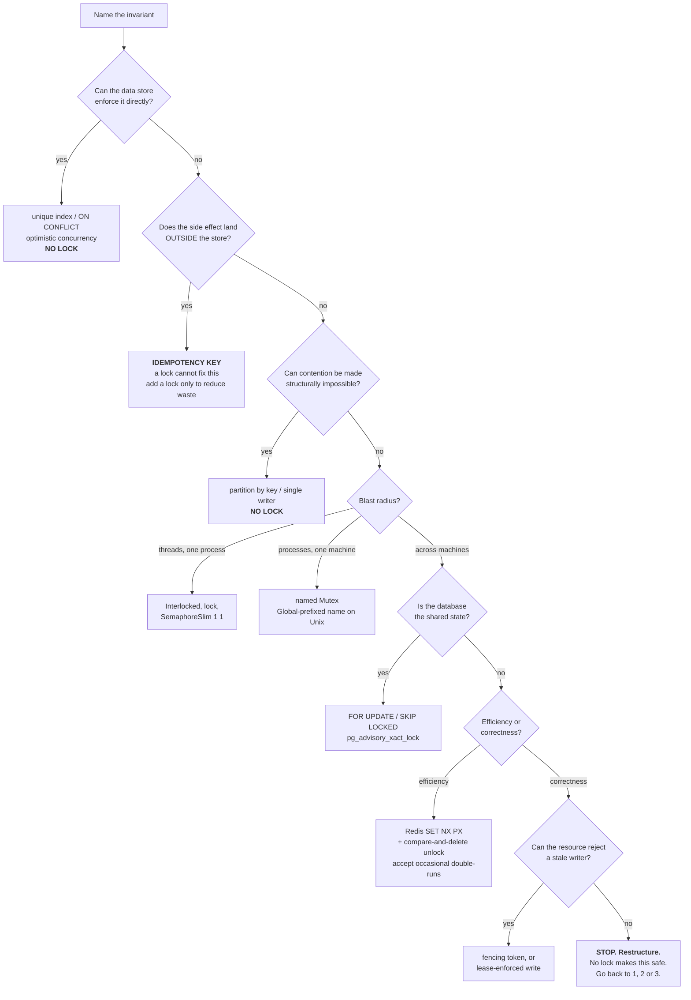

# Locking: a decision framework

For developers deciding whether they need a lock, and which one.

**How to use this.** Part 1 is the map — what exists and what each thing
actually guarantees. Part 2 is the eight questions you should be able to
answer before writing any lock. Part 3 is the decision tree. Part 4 is the
set of approaches that avoid locking entirely, which is where a surprising
number of these questions land.

The single most useful idea here:

> **A lock is never the goal. Protecting an invariant is.**
> Locking is one of several ways to do that, and it is the one that degrades
> worst as scope widens — from a language guarantee, to an OS guarantee, to a
> database guarantee, to a hopeful assumption about clocks.

---

## Part 1 — The map

What exists, and what it actually promises. **"Fences?" means: does the
protected resource itself reject a stale writer?** That column is the one
that separates "safe" from "safe as long as nothing pauses."

### In-process

| Mechanism | Async | Reentrant | The gotcha |
|---|---|---|---|
| `Interlocked` | n/a | n/a | Only helps when the invariant is a single word |
| `lock` / `Monitor` | **no** | yes | Cannot `await` inside — ownership is thread-bound |
| `System.Threading.Lock` (.NET 9+) | no | yes | Held in an `object`-typed variable it silently falls back to `Monitor`, **and the two do not mutually exclude each other** |
| `SemaphoreSlim(1,1)` | **yes** | **no** | `new SemaphoreSlim(1)` sets maxCount to `int.MaxValue` — a stray `Release()` silently raises your concurrency limit |
| `ReaderWriterLockSlim` | no | opt-in | Frequently slower than a plain `lock`; measure before assuming |
| `Lazy<T>` | n/a | n/a | The lock you didn't have to write |

### One machine

| Mechanism | Scope | The gotcha |
|---|---|---|
| named `Mutex` | **POSIX session on Unix**, not the machine | Unprefixed names are scoped to `getsid`. Use a `Global`-prefixed name or your single-instance guard silently fails across systemd units and SSH sessions |

### Database

| Mechanism | Releases on crash | Fences? | The gotcha |
|---|---|---|---|
| `SELECT … FOR UPDATE` | yes — tx rollback | implicitly yes | The row must already exist |
| `FOR UPDATE SKIP LOCKED` | yes | yes | It's a work queue, not a mutex — that's the point |
| `pg_advisory_xact_lock` | yes — commit/rollback | no | `hashtext()` returns `integer`, so the common idiom has ~2³² keys, not 2⁶⁴ |
| `pg_advisory_lock` | on disconnect only | no | **Leaks through any connection pool** — including Npgsql's own, which is on by default |
| Optimistic concurrency | n/a | **yes** | Retry storms under high contention |
| Unique index / `ON CONFLICT` | n/a | **yes** | Free, and usually the right answer to "only once" |

### Across machines

| Mechanism | Releases on crash | Fences? | The gotcha |
|---|---|---|---|
| Redis `SET NX PX` | TTL | no | Unlock must be compare-and-delete; expires mid-work |
| Redlock | TTL | no | Contested; see §4 of the talk. Complexity for a safety property it doesn't fully deliver |
| etcd / ZooKeeper lease | session expiry | **yes** (revision/zxid) | Real answer, real ops cost |
| Azure Blob lease | 15–60s or infinite | **that blob only** | `DistributedLock.Azure` leases a *sentinel* blob by default, which gives you mutual exclusion without the fencing |
| Idempotency key | n/a | **yes** | Needs a dedupe store — and is stronger than any lock |

---

## Part 2 — The eight questions

### Four you must answer, or stop

**1. What invariant am I protecting?**
"Only charge the card once" is an invariant. "Two threads shouldn't run this
method" is a symptom. If you can't state it as a property of the data or the
world, you don't yet have a problem statement — and you will pick the wrong
tool.

**2. What does a double-run actually cost?**
This is the fork everything else hangs off.

- **Efficiency** — you pay twice, waste CPU, send a duplicate log line. A
  sloppy lock is fine.
- **Correctness** — data is corrupted, a customer is charged twice, a
  document is overwritten. **A lock alone is never sufficient here.**

**3. Where does the side effect land — inside or outside the store?**
If the protected action reaches outside your transactional store — a payment
API, an email, a partner call, a file — then no lock can prevent duplicates,
because the lock and the side effect can't commit atomically. You need
idempotency.

**4. What's the blast radius?**
Threads in one process? Processes on one machine? Processes across a fleet?
This picks the mechanism family, and it's the question people *think* is
first. It's fourth.

### Four that pick the mechanism

**5. How long is the critical section?**
Milliseconds inside a transaction → a database lock. Minutes → you need a
lease with renewal, and you should ask whether the work can be broken up
instead.

**6. What's the contention?**
Low → optimistic concurrency wins; retries are rare and there's no waiting.
High → locking or queueing wins; optimistic retry turns into a livelock.

**7. Can the protected resource reject a stale writer?**
If yes, you can fence, and you can be genuinely safe. If no, you are relying
on nothing pausing at the wrong moment. Most real resources — an email, an
API call, a physical action — cannot be fenced. Say so out loud.

**8. How will you know when it breaks?**
Locks fail silently. Both the PgBouncer/Npgsql advisory-lock violation and
the expired-TTL double-run produce **no error and no log line**. If you can't
answer this, add a counter or an assertion before you add the lock.

---

## Part 3 — The decision tree



### The same tree, as text

```
0.  Name the invariant.
    Can't name it? You don't have a problem statement. Stop here.

1.  Can the data store enforce it directly?
      uniqueness ................ unique index / INSERT ON CONFLICT
      don't-clobber ............. optimistic concurrency (version column)
      append-only ............... just append
    YES -> no lock. Done.

2.  Does the protected side effect land outside the store?
    (payment, email, partner API, file, published message)
    YES -> you need IDEMPOTENCY, not mutual exclusion.
           A lock reduces duplicates; it cannot prevent them.
           You may still add a lock, but only as an efficiency measure.

3.  Can contention be made structurally impossible?
      partition by key (Kafka, actor, consistent hash)
      one designated writer
    YES -> no lock. Done.

4.  Blast radius?
      threads, one process ...... Interlocked > lock/Lock > SemaphoreSlim(1,1)
                                  (pick the first one that fits; async forces
                                   SemaphoreSlim)
      processes, one machine .... named Mutex, Global-prefixed on Unix
      across machines ........... continue

5.  Is the database the shared state, and does the work fit in a transaction?
      row already exists ........ SELECT ... FOR UPDATE
      pulling from a queue ...... FOR UPDATE SKIP LOCKED
      no row yet / abstract key . pg_advisory_xact_lock
      never .................... pg_advisory_lock  (leaks through pools)
    YES -> done. This is the best distributed lock most teams have.

6.  Efficiency or correctness?
    EFFICIENCY -> Redis SET NX PX + unique token + compare-and-delete unlock.
                  Write "this lock is approximate" in a comment, and mean it.
    CORRECTNESS -> continue. The lock alone is not enough.

7.  Can the protected resource reject a stale writer?
    YES -> fencing token, version check, or a lease the service enforces
           (Azure Blob lease on that blob). This is the only genuinely safe
           distributed answer.
    NO  -> STOP AND RESTRUCTURE. There is no lock that makes this correct.
           Return to step 1, 2 or 3.
```

### Why the order is what it is

Most developers enter at step 4 — "I need a distributed lock, which one?" —
and the framework's whole job is to make steps 1 to 3 happen first. In
practice a large fraction of "I need a distributed lock" questions terminate
at step 1 or step 2, and the answer is a unique index or an idempotency key.

Step 7's dead end is deliberate. A framework that always yields an answer is
lying: some designs cannot be made correct with a lock, and the honest output
is "change the design", not "use Redlock and hope."

---

## Step 1 in practice — what the store can enforce for you

Worth its own section, because it's where most "I need a distributed lock"
questions actually terminate, and because the second and third patterns below
are badly under-known.

The shape is always the same: **let two writers race, let the database pick a
winner, and handle the loser's error as a normal outcome rather than a fault.**

### Only once → unique constraint

```sql
create unique index on payments (order_id);
insert into payments (order_id, amount) values (123, 4200)
on conflict do nothing;
```

No lock, no TTL, no coordination. Correct under any concurrency — and enforced
even against a writer who doesn't know the rule exists: a migration, a manual
`psql` session, another service.

### Only once *among active rows* → partial unique index

```sql
create unique index on subscriptions (customer_id)
where status = 'active';
```

The usual answer to "a customer may have only one active subscription", which
people routinely try to enforce with a lock and a `SELECT` first.

### No overlap → exclusion constraint

The one most teams have never met. "No two bookings for the same room may
overlap" is a genuinely hard concurrency problem, and it is declarative:

```sql
create extension if not exists btree_gist;

create table bookings (
    room_id  int  not null,
    during   tstzrange not null,
    exclude using gist (room_id with =, during with &&)
);
```

Two concurrent overlapping inserts: one commits, the other is rejected. No
lock, no read-then-write, no race.

One caveat you won't find on the tin: the exclusion check takes locks
internally, so mutually-conflicting concurrent inserts **can deadlock**
(`40P01`). Postgres aborts a victim and the invariant still holds — but a
real caller must retry on `40P01` as well as handle `23P01`.

### The part people get wrong: the error path

Constraint-based concurrency is only usable if a violation is handled as
"someone else won", not as an exception that reaches the user.

```csharp
try
{
    await db.SaveChangesAsync();
    return Outcome.Created;
}
catch (PostgresException e) when (e.SqlState == "23505")   // unique_violation
{
    return Outcome.AlreadyExists;                          // not an error
}
```

| SQLSTATE | Meaning |
|---|---|
| `23505` | `unique_violation` |
| `23P01` | `exclusion_violation` |
| `23514` | `check_violation` |

### It is not a close call

`demos/08-no-lock.cs`, eight concurrent writers each time:

| Approach | Result |
|---|---|
| check-then-insert, no constraint | **8 rows** — the customer is charged 8 times |
| unique index + `ON CONFLICT DO NOTHING` | 1 row, 1 winner, 7 no-ops |
| `EXCLUDE` constraint | 1 booking, 1 winner, 7 rejected with `23P01` |

Same application concurrency in all three. The only difference is whether the
invariant was written into the schema.

### When this does *not* apply

- The invariant isn't expressible as a constraint.
- You must do external work (call an API, compute something expensive)
  *before* you can decide — a constraint can only reject after the fact.
- You need to **serialise** the work, not reject the loser. A constraint says
  "no"; a queue says "wait your turn."
- Conflicts are the common case, not the exception — then the error path is
  the hot path and you want a queue or a lock instead.

> `CHECK` constraints are per-row and cannot see other rows, so they can't
> enforce cross-row invariants. Reach for `UNIQUE` or `EXCLUDE` instead.

---

## Part 4 — Not locking

*(Populated from `research/09-no-lock-alternatives.md` — pending.)*

---

## Anti-patterns

| Smell | Why | Instead |
|---|---|---|
| `lock(this)`, `lock(typeof(X))`, `lock("literal")` | You're sharing a lock with code you don't control; string literals are interned process-wide | A private `readonly` lock object |
| `new SemaphoreSlim(1)` | maxCount is `int.MaxValue`; a stray `Release()` silently raises the limit | `new SemaphoreSlim(1, 1)` |
| `pg_advisory_lock` in a web request | Leaks onto the pooled connection; the next request inherits it | `pg_advisory_xact_lock` |
| Unlocking Redis with `DEL` | Deletes whoever holds it *now*, which may not be you | Compare-and-delete on your token |
| A distributed lock around a payment | Cannot be atomic with the side effect | Idempotency key |
| A lock with a TTL guarding "correctness" | The TTL will expire mid-work | Fencing, or restructure |
| Unprefixed named `Mutex` as a single-instance guard | Scoped to the POSIX session on Unix | `Global`-prefixed name |
| A lock with no metric | Locks fail silently | Count contention, timeouts, and lock-lost events |

---

## Appendix — folklore that doesn't survive checking

Every row verified against primary sources or by experiment. Details and
citations in [`research/`](research/).

| Commonly said | Actually |
|---|---|
| `System.Threading.Lock` is ~25% faster | No Microsoft source; traces to a third-party README |
| CS9217 = "can't lock in an async method" | **Microsoft Learn is wrong.** CS9217 is `ERR_RefLocalAcrossAwait` |
| `SemaphoreMaxCountExceededException` | Doesn't exist — it's `SemaphoreFullException` |
| Advisory locks have no timeout | `lock_timeout` and `statement_timeout` both apply |
| A named `Mutex` is machine-wide | On Unix it's scoped to the POSIX session |
| The PgBouncer issue is a leaked lock | It's a silent *mutual-exclusion violation* — a second client is told it acquired the lock |
| You need PgBouncer to hit that bug | Npgsql's own pool does it, on default settings |
| Azure blob lease ID is a fencing token | Equality-checked GUID, not monotonic |
